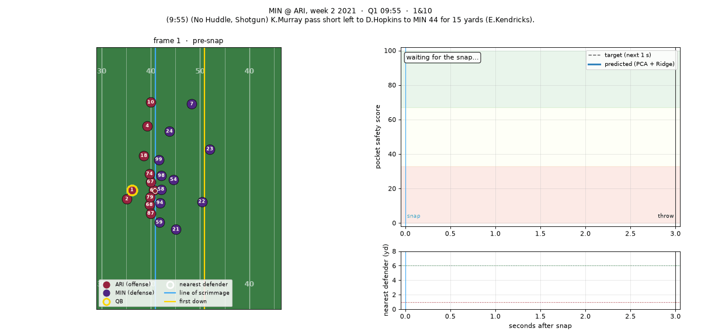

# NFLxAWS-Submission-2026-Samy-and-Arij

## Pass Pocket Safety Score (PCA + Ridge / Lasso)

Predicts a per-frame **Pocket Safety Score (0–100)** from NFL Big Data Bowl 2023 tracking data
([dataset](https://github.com/ThompsonJamesBliss/nfl-big-data-bowl-regional-event-data)). 100 means a clean pocket and 0 means the pocket has collapsed.

```bash
# 1. data (~830 MB, not committed) -> ./data_repo/data
curl -L -o repo.zip https://codeload.github.com/ThompsonJamesBliss/nfl-big-data-bowl-regional-event-data/zip/refs/heads/main
unzip -q repo.zip && mv nfl-big-data-bowl-regional-event-data-main data_repo && rm repo.zip

# 2. environment (Python 3.9+)
python3 -m pip install -r requirements.txt

# 3. run (~1–2 min on 8 cores)
python3 run.py                     # add --rebuild to recompute the frame cache
```

**Data location.** `run.py` looks for a folder that contains `plays.csv`, `pffScoutingData.csv` and `tracking/tracking_*.csv`. It searches these places, in order:
- `./data_repo/data`
- `./data`
- `./nfl-big-data-bowl-regional-event-data[-main]/data`
- the same dataset folder placed **next to** this repo, e.g. `~/Documents/GitHub/nfl-big-data-bowl-regional-event-data`

If the data is somewhere else, pass its path with `--data-dir` or set `POCKET_DATA_DIR`. Either one accepts the dataset root or its `data/` folder:
```bash
python3 run.py --data-dir ~/Downloads/nfl-big-data-bowl-regional-event-data
```
If no data is found, the script exits with a message listing every path it searched.

Outputs are written to `outputs/`. The 149 MB frame cache `outputs/frames.parquet` is rebuilt locally and not committed.

## Pipeline
1. **Clean (`data.load_tracking`)**: drop `time`; flip plays with `playDirection == "left"` so offense always moves left to right (x, y, o, dir), then drop `playDirection`; convert `o` and `dir` to sin/cos; set `is_offense` where `team == possessionTeam`.
2. **Events**: find the snap and the end of the pocket phase (first `pass_forward`, `qb_sack`, `qb_strip_sack`, `run` or `fumble` after the snap). Only frames from the snap to the end of the pocket are kept.
3. **QB identification**: the offensive player closest to the ball in the most post-snap frames, not counting the snapper. It matches PFF's `pff_role == "Pass"` on **97.5 %** of 8,533 plays. After this step `event` is dropped.
4. **Frame features (165)**: `frameId`, `frames_since_snap`, the QB's depth behind the line of scrimmage, its y position and kinematics, plus the 7 defenders and 7 offensive teammates nearest the QB. Each of those players gets x and y relative to the QB, `s`, `a`, `dis`, sin/cos of `o` and `dir`, distance to the QB and closing speed. The id columns stay in the DataFrame and are left out of `FEATURES` only when the model is fit.
5. **Target (heuristic)**: `d_future` is the shortest distance from any defender to the QB over the next 1.0 s. The score is 0 when `d_future` ≤ 1 yd, 100 when it is ≥ 6 yd, and linear in between.
6. **Models**: `StandardScaler → PCA → Ridge` and `StandardScaler → PCA → Lasso`. The test set is 20 % of games, split by `gameId`. PCA variance and alpha are tuned by **adjusted R²** with 3-fold `GroupKFold` CV (grouped by game). The model with the best CV score is saved. Predictions are clipped to [0, 100].

**Adjusted R²** = 1 − (1 − R²)(n − 1)/(n − p − 1). Here *p* is the number of predictors the regressor actually uses: every PCA component for Ridge, and only the non-zero coefficients for Lasso.

## Results (25 held-out games, 54,966 frames)
| Model | p | Test adj. R² | RMSE | MAE | PFF pressure AUC |
|---|---|---|---|---|---|
| **PCA (133 comps, 99 % var) + Ridge (α=0.01)** — selected | 133 | **0.762** | 13.35 | 10.21 | 0.866 |
| PCA (133 comps, 99 % var) + Lasso (α=0.001) | 133 | 0.762 | 13.35 | 10.21 | 0.866 |
| Predict the training mean | 0 | 0.000 | 27.41 | 23.24 | — |
| Same mapping applied to *current* nearest-defender distance | 1 | 0.218 | 24.24 | 17.41 | — |

### Ridge vs Lasso
- **The two models tie.** Both reach a CV adjusted R² of 0.764 and a test adjusted R² of 0.762. Ridge was kept because it is simpler and faster to fit.
- **Regularisation barely matters here.** There are about 220k training frames and only 133 predictors. Ridge's score is flat across alpha from 0.01 to 100. Lasso's best alpha is the smallest one tested, and it keeps all 133 components.
- **Lasso's sparsity costs accuracy** (`lasso_sparsity.png`):

  | Lasso α | Non-zero components | CV adj. R² |
  |---|---|---|
  | 0.001 | 133 | 0.764 |
  | 0.1 | 118 | 0.760 |
  | 0.3 | 92 | 0.742 |
  | 1.0 | 37 | 0.665 |
  | 3.0 | 10 | 0.570 |

  Lasso can drop about 15 components for a loss of 0.004. Below about 90 components the fit falls off quickly.
- **Keeping more PCA variance helps both models.** At 99 % variance the CV adjusted R² is 0.764, compared with 0.728 at 95 % (`ridge_vs_lasso.png`).

**External check:** PFF pressure charts were never used in training. Even so, a play's lowest predicted score separates plays PFF charted as a hit, hurry or sack from the rest with **AUC 0.866**.

Figures in `outputs/`: `ridge_vs_lasso.png`, `lasso_sparsity.png`, `pca_variance.png`, `pred_vs_actual.png`, `feature_importance.png`, `pff_validation.png`, `play_timelines.png`, `field_snapshot.png`.

## Key example
[`keyExample/`](keyExample/) walks through one clean-pocket play, Murray to Hopkins for 15 yards. It has an animated GIF of the player tracking synced with the pocket safety score, plus static key frames and a per-frame CSV.


