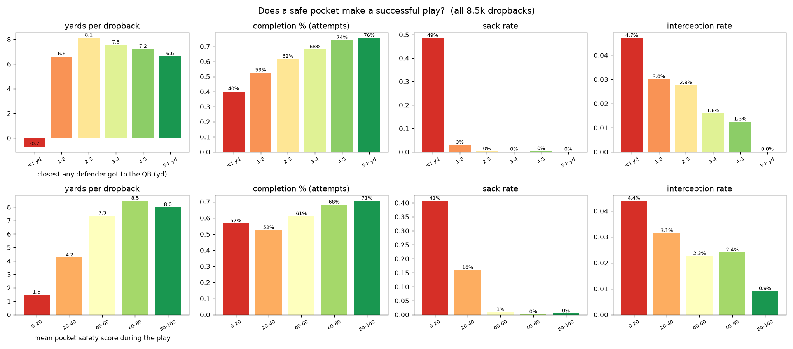
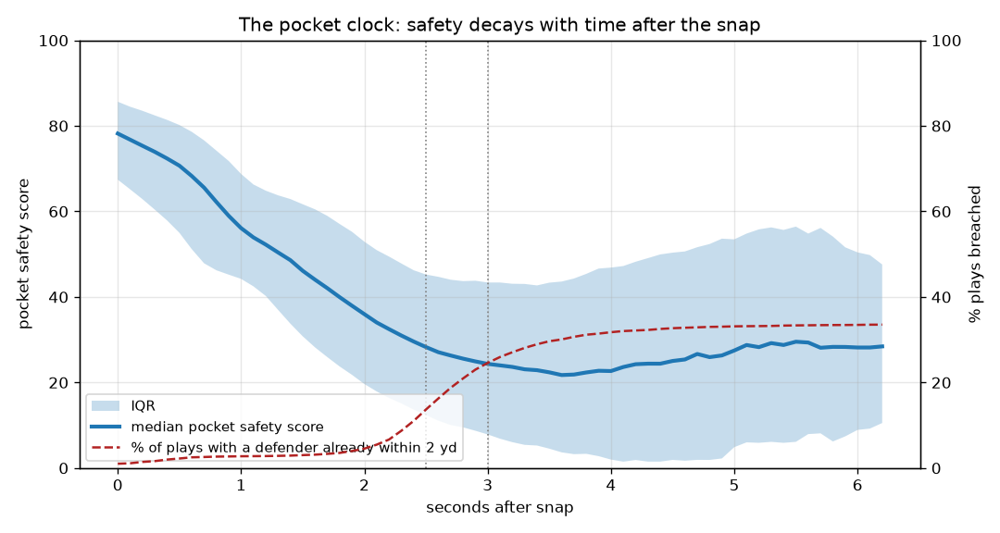
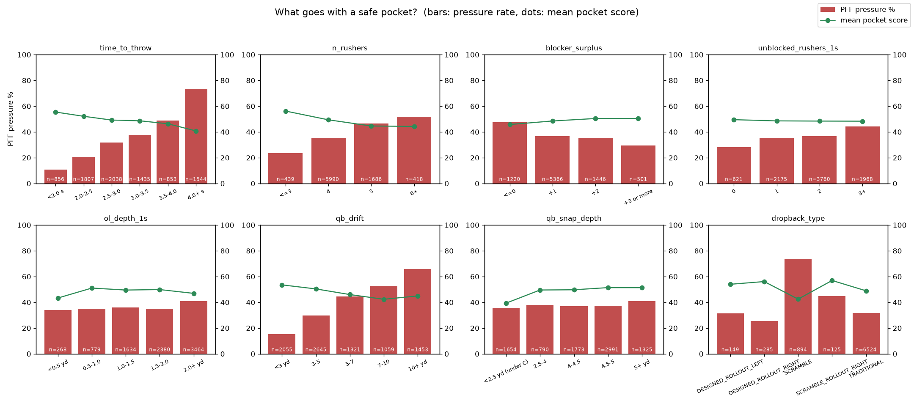
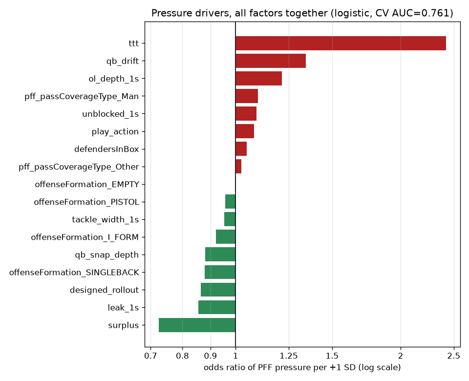
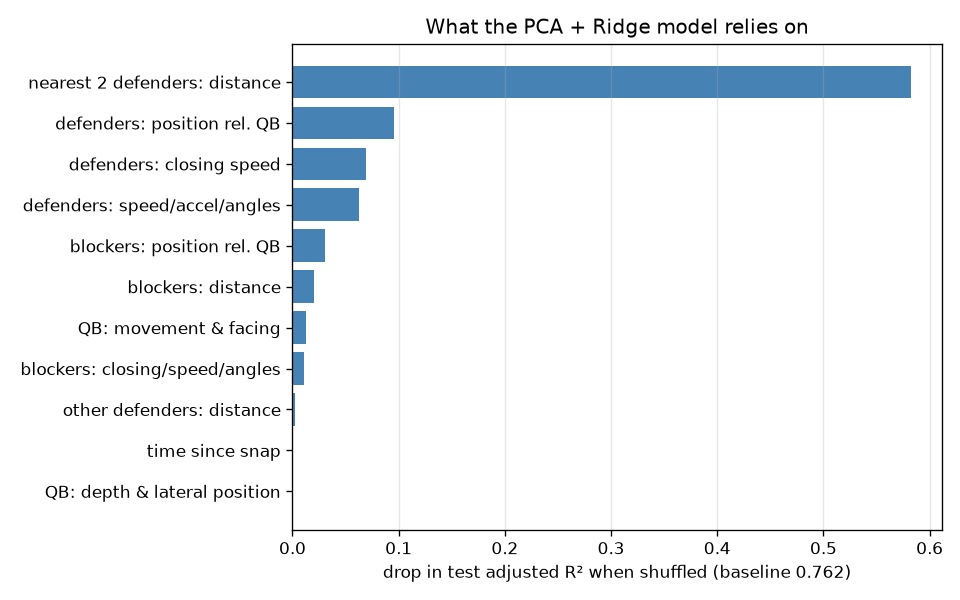

# What makes a successful, safe pocket?

This analysis covers 8,533 dropbacks from 122 games of BDB 2023 data (weeks 1–8, 2021). Run it with `python judge/analysis/pocket_drivers.py`; it takes about 40 s. Every number below comes from `output/tables.md` and `output/*.csv`.

## 1. A safe pocket does make plays succeed

| Closest any defender got to the QB | Completion % | INT rate | Sack rate | Yards / dropback |
|---|---|---|---|---|
| < 1 yd | 40.1% | 4.7% | 48.5% | −0.68 |
| 1–2 yd | 52.6% | 3.0% | 2.9% | 6.61 |
| 2–3 yd | 61.7% | 2.8% | 0.2% | 8.12 |
| 3–4 yd | 68.0% | 1.6% | 0.0% | 7.54 |
| 4–5 yd | 74.2% | 1.3% | 0.3% | 7.21 |

- **Plays PFF charted as pressured:** 46.6% completions and 3.9 yd per dropback. Clean plays: 67.8% and 8.1 yd.
- **Completion % rises with every extra yard of space.** INT rate falls by about 70% (4.7% → 1.3%) from the <1 yd group to the 4–5 yd group.
- **Yards peak at 2–3 yd, not at the cleanest pockets.** The cleanest pockets are often quick, short throws.

**Time matters only if the pocket holds.** Yards per dropback by time to throw:

| Time to throw | Clean (no PFF pressure) | Pressured |
|---|---|---|
| < 2.0 s | 5.98 | 4.67 |
| 2.5–3.0 s | 8.20 | 5.45 |
| 3.5–4.0 s | **10.57** | 3.46 |
| 4.0+ s | 9.31 | **2.29** |

A clean pocket that lasts 3.5 s or more gives the most yards in the data. A pressured QB who holds the ball loses value the longer he holds it.

## 2. The pocket clock

The median pocket safety score falls steadily after the snap:

| Seconds after snap | 0 | 1.0 | 2.0 | 2.5 | 3.0 |
|---|---|---|---|---|---|
| Median score | 78 | 56 | 36 | 28 | 24 |

- A defender has come within 2 yd of the QB on only **4.5% of plays by 2.0 s**.
- That rises to **13.7% by 2.5 s** and **24.6% by 3.0 s**.
- **The pocket usually holds for about 2.0–2.5 s.** Breakdowns pick up quickly between 2.5 and 3.0 s.
- Pressure rate by time to throw: 10.7% under 2.0 s, 37.8% at 3.0–3.5 s and 73.6% at 4.0 s or more.

## 3. What goes with a safe pocket

The second chart comes from a logistic regression of PFF pressure on all the factors together, so each one is measured with the others held fixed. Its cross-validated AUC, grouped by game, is 0.76. The mechanics features are measured 1.0 s after the snap.

| Factor | Pressure rate (one variable at a time) | Odds ratio per +1 SD (all factors) | Takeaway |
|---|---|---|---|
| **Blocker surplus** (blockers − rushers) | ≤0: 47.6%, +1: 36.5%, +2: 35.5%, +3: 29.5% | **0.73** | The strongest protective factor. Keep at least one extra blocker. |
| **Rushers sent** | 3: 23.7%, 4: 35.0%, 5: 46.6%, 6+: 51.7% | (part of surplus) | Blitzes bring pressure. Completion % drops from 62% to 52% against 6+ rushers. |
| **Time to throw** | 10.7% → 73.6% (see §2) | **2.42** | The biggest single factor. Part of this is reverse causation, because pressure makes plays last longer. |
| **QB drift** (path length in the pocket) | < 3 yd: 15.3%, 10+ yd: 65.9% | **1.34** | A stable launch point goes with clean pockets and 70% completions. Drift is partly a reaction to pressure. |
| **OL pushed back at 1.0 s** | 1.0–1.5 yd: 36.0%, 2.0+ yd: 40.9% (sacks 5.1% → 8.0%) | **1.21** | Holding the line near the line of scrimmage keeps the pocket from collapsing into the QB. |
| **Unblocked rushers at 1.0 s** (no blocker within 1.5 yd) | 0: 28.2%, 3+: 44.3% | 1.09 | Engaging every rusher early matters. |
| **Man coverage** (vs zone) | 41.6% vs 35.4%; completions 53% vs 65% | 1.10 | Tight coverage makes the QB hold the ball. |
| **Designed rollout** | 25.6–31.5% vs 31.8% traditional; ~69% completions | 0.86 | Moving the pocket on purpose helps. Unplanned scrambles see 73.8% pressure. |
| **Tackle width at 1.0 s** | 8+ yd: 32.2%, < 6 yd: 39.2% | 0.95 | A wider pocket edge helps a little. |
| QB depth at snap / formation | under centre 35.7%, shotgun 5+ yd 41.1% | 0.88 (deeper = less) | Weak and mixed. See the caveats. |
| Play action | 38.8% vs 37.1% | 1.08 | No protection benefit, but +1.7 yd per dropback. |
| Defenders in the box | flat (37–38%) | 1.05 | Box count alone tells you little. |

**What the model relies on**, measured by how much the test adjusted R² drops when a group of features is shuffled:

- **The two nearest defenders' distances dominate** (−0.58).
- Next come defender positions relative to the QB (−0.10) and defender closing speed (−0.07).
- Blocker positions contribute −0.03.
- Once the players' positions are known, time since the snap and the QB's own depth add almost nothing.

## Bottom line: a successful, safe pocket
1. **Keep the nearest rusher 3+ yards away.** Completions rise to 68–76%, sacks drop to about 0% and the INT rate is cut by more than half.
2. **Win the numbers.** Have at least as many blockers as rushers, ideally one or two more. Every rusher should be engaged within the first second.
3. **Hold the line's depth.** The offensive line shouldn't be pushed 2+ yards behind the line of scrimmage by 1.0 s.
4. **Give the QB a stable platform.** QBs who drift less than 3 yards are pressured on 15% of plays. A designed rollout beats an unplanned scramble.
5. **Respect the clock.** Expect about 2.0–2.5 s of clean pocket. Hold the ball past 3 s only when the pocket is still clean; that is when the biggest gains come.

## Caveats
- **This shows association, not causation.** Time to throw and QB drift are partly caused by pressure, not only causes of it.
- **The pocket safety score is a distance-based label.** It treats an under-centre QB as less safe at the snap because he starts close to the defensive line, even though nothing has happened yet. That is why the under-centre and I-form rows have low mean scores but normal pressure rates.
- **PFF pressure is charted by people**, not measured from tracking data.
- **"Success" here means completion %, INTs, sacks and yards.** The dataset has no EPA.
