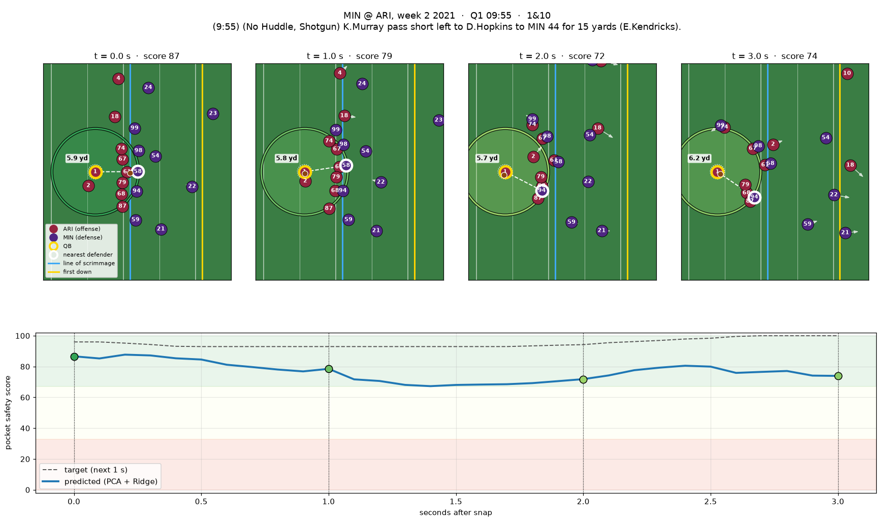

# Key example: a clean pocket, frame by frame

**MIN @ ARI, week 2 2021, Q1 9:55, 1st & 10.** K. Murray passes short left to D. Hopkins for **15 yards**. The game is in the held-out test set, so the model never trained on it, and PFF charted no hit, hurry or sack on the play.


The animation plays at half speed, and the score panels are lined up in time with the players:
- **Left: player tracking.** Plays are normalised so the offense moves to the right. ARI is in red and MIN in purple, with jersey numbers on each player.
  - The QB has a gold ring and the nearest defender a white ring. A dashed line joins them, labelled with the distance in yards.
  - The 6-yard ring around the QB is coloured by the predicted pocket safety score (red = 0, green = 100). The white dotted ring is the 1-yard "collapsed" radius.
  - Arrows show each player's velocity. The blue line is the line of scrimmage and the yellow line is the first-down marker.
- **Top right: pocket safety score.** The blue line is the model's prediction (PCA + Ridge) and the dashed line is the target, both drawn progressively from snap to throw.
- **Bottom right: nearest defender's distance to the QB**, in yards.



| t after snap | Predicted | Target | Nearest defender |
|---|---|---|---|
| 0.0 s | 86.7 | 96.0 | #58 at 5.9 yd |
| 1.0 s | 78.5 | 93.0 | #58 at 5.8 yd |
| 1.4 s | 67.3 (lowest) | 93.0 | #94 at 5.7 yd |
| 2.0 s | 71.8 | 94.2 | #94 at 5.7 yd |
| 3.0 s (throw) | 73.9 | 100.0 | #94 at 6.2 yd |

**What happens.** The offensive line holds, and no defender gets inside about 5.6 yards of Murray for the whole 3.0 s. The predicted score stays in the green band (above 67) the entire time. Its lowest point, 67.3 at 1.4 s, comes as #94 works toward the QB. It recovers as the pocket holds, and Murray throws from a clean pocket.

**What the model gets wrong.** The prediction stays below the target the whole time, by 18.5 points on average (between 7 and 26). On a play like this, Ridge regression pulls its estimate toward the average and doesn't fully trust a "fully clean" pocket. It still ranks the play correctly as safe the whole way through.

## Reproduce / try another play
```bash
python3 judge/keyExample/make_key_example.py                                  # this play
python3 judge/keyExample/make_key_example.py --game 2021092611 --play 3118    # any gameId/playId
python3 judge/keyExample/make_key_example.py --data-dir /path/to/dataset --fps 10
```
Predictions come from `judge/outputs/test_predictions.parquet` for held-out plays, and from `judge/outputs/model.joblib` otherwise. Each run also writes `play_frames.csv` with the per-frame scores and nearest-defender distance.
